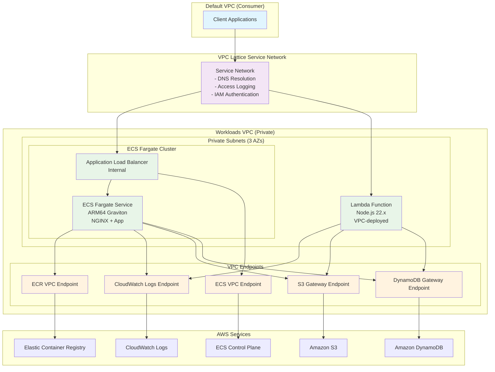

```mermaid
graph TB
    subgraph "Default VPC (Consumer)"
        Client[Client Applications]
    end
   
    subgraph "VPC Lattice Service Network"
        ServiceNetwork[Service Network<br/>- DNS Resolution<br/>- Access Logging<br/>- IAM Authentication]
    end
   
    subgraph "Workloads VPC (Private)"
        subgraph "Private Subnets (3 AZs)"
            subgraph "ECS Fargate Cluster"
                ALB[Application Load Balancer<br/>Internal]
                ECSService[ECS Fargate Service<br/>ARM64 Graviton<br/>NGINX + App]
            end
            
            Lambda[Lambda Function<br/>Node.js 22.x<br/>VPC-deployed]
        end
       
        subgraph "VPC Endpoints"
            ECREndpoint[ECR VPC Endpoint]
            LogsEndpoint[CloudWatch Logs Endpoint]
            ECSEndpoint[ECS VPC Endpoint]
            S3Gateway[S3 Gateway Endpoint]
            DynamoGateway[DynamoDB Gateway Endpoint]
        end
    end
   
    subgraph "AWS Services"
        ECR[Elastic Container Registry]
        CloudWatch[CloudWatch Logs]
        ECSControl[ECS Control Plane]
        S3[Amazon S3]
        DynamoDB[Amazon DynamoDB]
    end
   
    %% VPC Lattice Connections
    Client --> ServiceNetwork
    ServiceNetwork --> ALB
    ServiceNetwork --> Lambda
   
    %% Internal Connections
    ALB --> ECSService
   
    %% VPC Endpoint Connections
    ECSService --> ECREndpoint
    ECSService --> LogsEndpoint
    Lambda --> LogsEndpoint
    ALB --> ECSEndpoint
   
    %% Gateway Endpoints
    ECSService --> S3Gateway
    Lambda --> S3Gateway
    ECSService --> DynamoGateway
    Lambda --> DynamoGateway
   
    %% AWS Service Connections
    ECREndpoint --> ECR
    LogsEndpoint --> CloudWatch
    ECSEndpoint --> ECSControl
    S3Gateway --> S3
    DynamoGateway --> DynamoDB
   
    %% Styling
    classDef vpc fill:#e1f5fe
    classDef lattice fill:#f3e5f5
    classDef service fill:#e8f5e8
    classDef endpoint fill:#fff3e0
   
    class Client vpc
    class ServiceNetwork lattice
    class ALB,ECSService,Lambda service
    class ECREndpoint,LogsEndpoint,ECSEndpoint,S3Gateway,DynamoGateway endpoint
```